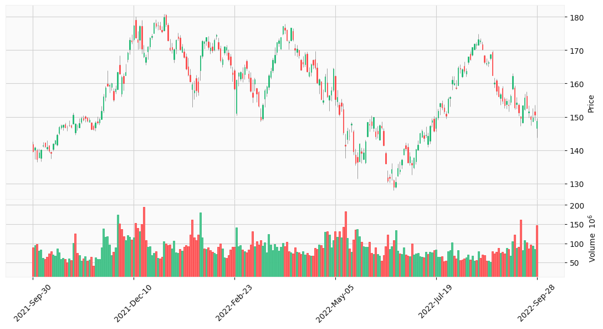
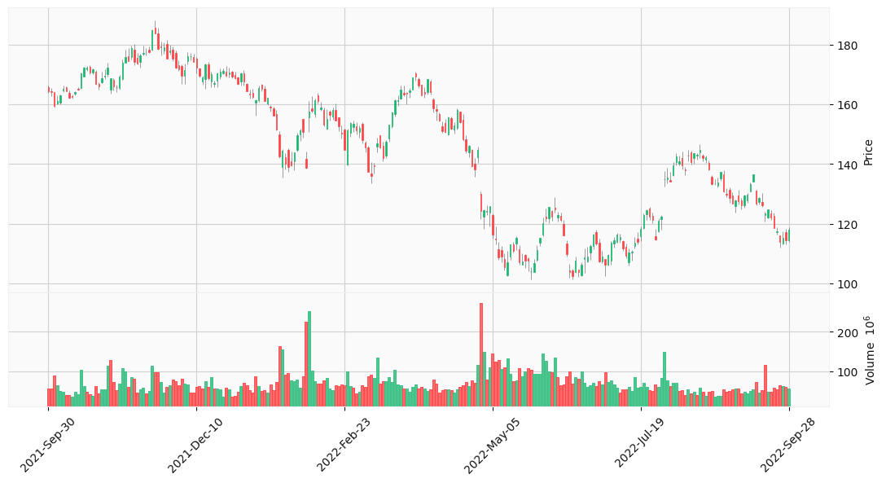
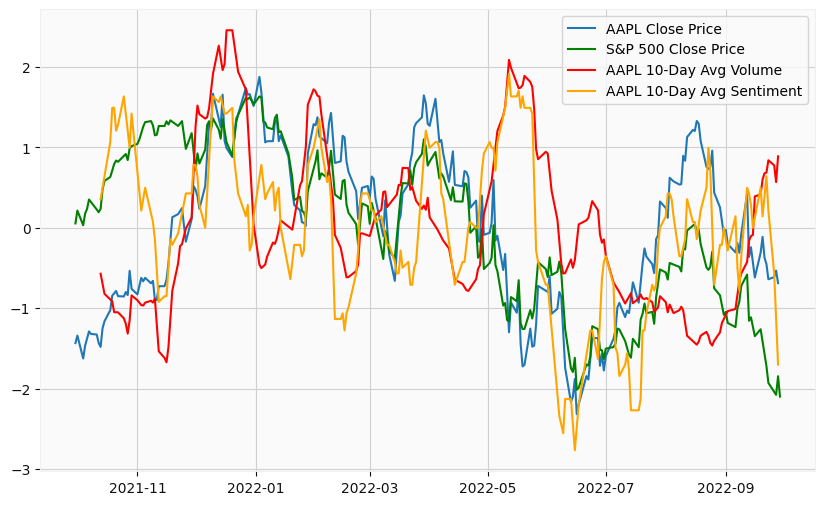

# Stock Prediction Project

## Overview

This project aims to forecast the closing prices and directions of stock movements for Apple (AAPL) and Amazon (AMZN) using AutoRegressive (AR) models. The models utilize various external variables such as trading volume, sentiment derived from Twitter data, and the S&P 500 index to predict future stock prices and directions.

## Data Collection

- **Yahoo Finance**: Historical stock data for AAPL and AMZN from 2021-09-30 to 2022-09-30.
- **Twitter Data**: Sentiment data collected from tweets about AAPL and AMZN using a custom sentiment analysis function.

## Models Used

### AutoRegressive (AR) Model

- **Price Prediction**: Forecasts the stock price at time `t` using a specified lag.
- **Direction Prediction**: Predicts the gradient (up or down) of stock price movements using a specified lag.

### External Variables

- **Volume**: Trading volume of the stock.
- **Sentiment**: Sentiment analysis of tweets.
- **S&P 500 Index**: Overall market movement.

## Results

The project evaluates different models by comparing their Mean Absolute Error (MAE):

- **Apple (AAPL)**:

  - AR model with S&P 500 as an external variable.
  - AR model with Sentiment as an external variable.
  - AR model with Volume as an external variable.
  - AR model without external variables.

- **Amazon (AMZN)**:
  - Similar analysis as for AAPL.

## Visualizations

- **Candle Charts**: Visual representations of stock prices for AAPL and AMZN.

  - 
  - 

- **Price and Sentiment Analysis**: Graphs comparing normalized stock prices, average trading volume, and sentiment over time.
  - 
  - 

## How to Run the Code

1. **Clone the Repository**:

   ```bash
   git clone https://github.com/emilwestling/StockPrediction.git
   cd StockPrediction
   ```

2. **Install Dependencies**:

   ```bash
   pip install -r requirements.txt
   ```

3. **Run the Jupyter Notebook**:
   - Open the notebook `stock_prediction.ipynb` in Jupyter Notebook or JupyterLab.

## Repository Structure

- `stock_prediction.ipynb`: Jupyter Notebook containing the project code and analysis.
- `images/`: Directory containing visualizations and charts.
- `data/`: Directory containing tweets that are used for sentiment analysis.
- `requirements.txt`: File listing the necessary Python packages for the project.

## Project Repository

You can find the full code and data on my [GitHub repository](https://github.com/emilwestling/StockPrediction).

## Conclusion

This project demonstrates how different models and external factors impact stock price predictions. It highlights the importance of choosing appropriate variables and models for financial forecasting.

## License

This project is licensed under the MIT License. See the [LICENSE](LICENSE) file for details.

## Contact

If you have any questions or feedback, please contact me at [westling01@gmail.com](mailto:westling01@gmail.com).
